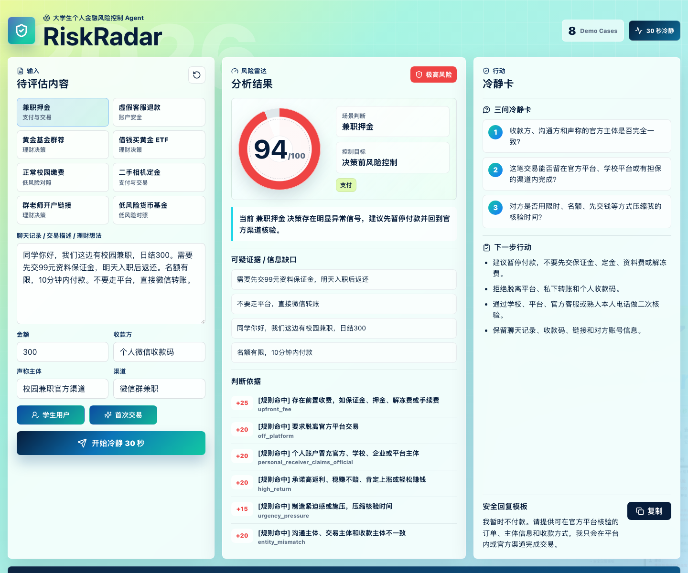
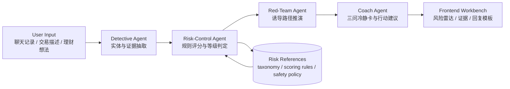

# RiskRadar

> 大学生个人金融风险控制 Agent：在付款、借贷、提交敏感资料或跟风投资之前，让用户先冷静 30 秒。

RiskRadar is a full-stack prototype for a college-student personal finance risk-control Agent. It combines a polished React workbench, a deterministic risk-scoring engine, and an ArkClaw Skill package. The system turns raw chat records, transaction descriptions, and investment ideas into explainable, reproducible, and actionable risk assessments.



## Why RiskRadar

很多个人金融风险并不是在损失发生后才暴露，而是在用户付款、借贷、共享验证码、打开屏幕共享或跟风下单前的几十秒内已经出现明显信号。

RiskRadar 关注的不是事后追责，而是决策前拦截：

- 不是替用户付款或下单，而是在关键动作前做风险冷静。
- 不是只输出一句“有风险”，而是给出证据、分数、信息缺口和下一步行动。
- 不是单纯依赖大模型自由生成，而是用规则评分、案例库、输出契约和 Agent Teams 叙事保证稳定性。
- 不是把所有金融场景都判成诈骗，而是同时识别高风险、信息不足和相对低风险的官方流程。

## Product Scope

RiskRadar 面向大学生和年轻用户的高频个人金融场景：

| Category | Scenarios | Main Risk Signals |
| --- | --- | --- |
| 支付与交易 | 兼职押金、二手交易、校园缴费、熟人借钱 | 前置收费、脱离平台、主体不一致、紧急付款、第三方收款 |
| 账户安全 | 网购退款、验证码、屏幕共享、远程协助 | 冒充客服、索要验证码、下载会议软件、账户冻结威胁 |
| 借贷风险 | 校园贷、分期、代付、短期借款 | 资料套取、暴力催促、身份未核验、资金用途不清 |
| 理财决策 | 基金、股票、黄金、ETF、银行理财 | 看不懂产品、不了解费率和赎回、借钱投资、重仓 |
| 社群荐投 | 群老师带单、开户链接、内幕消息、直播间推荐 | 高收益承诺、FOMO、非官方链接、不可独立核验 |

## Core Output Contract

每次分析都围绕固定输出契约，避免演示和评审复现时回答漂移：

| Order | Field | Meaning |
| --- | --- | --- |
| 1 | 风险等级 | 低风险 / 中风险 / 高风险 / 极高风险 |
| 2 | 风险分数 | 0-100 的可解释风险分数 |
| 3 | 场景判断 | 单一主场景标签 |
| 4 | 判断依据 | 命中的规则、红队推演、核验状态 |
| 5 | 可疑证据 / 信息缺口 | 用户原文证据或缺失的关键信息 |
| 6 | 三问冷静卡 | 用户付款、借贷或投资前必须回答的 3 个问题 |
| 7 | 下一步行动 | 暂停付款、官方核验、补足信息、保留证据等 |
| 8 | 安全回复模板 | 可以直接复制给对方的安全话术 |

## System Architecture



The repository keeps two aligned implementations:

- `backend/risk-radar-finance-control/scripts/risk_score.py`: canonical Python scoring engine for reproducible backend and ArkClaw evaluation.
- `src/lib/analyzer.ts`: mirrored TypeScript scoring logic for instant frontend demos without network calls.

This design lets the frontend feel real-time while the backend package remains auditable, testable, and reusable.

## Repository Layout

```text
.
├── backend/
│   └── risk-radar-finance-control/
│       ├── SKILL.md
│       ├── agents/
│       ├── assets/
│       │   ├── sample_inputs.json
│       │   ├── expected_outputs.json
│       │   ├── demo_script.md
│       │   └── arkclaw_test_prompts.md
│       ├── references/
│       │   ├── risk_taxonomy.md
│       │   ├── scoring_rules.md
│       │   ├── output_contract.md
│       │   ├── safety_policy.md
│       │   └── investment_checklist.md
│       └── scripts/
│           ├── risk_score.py
│           └── run_eval.py
├── docs/
│   ├── project/
│   │   ├── project-brief.md
│   │   ├── coze-workflow.md
│   │   └── submission-notes.md
│   └── riskradar-workbench.png
├── src/
│   ├── components/
│   ├── data/
│   ├── lib/
│   ├── App.tsx
│   └── styles.css
├── package.json
└── vite.config.ts
```

## Frontend Workbench

The frontend is a three-panel product interface, not a landing page.

| Panel | Purpose |
| --- | --- |
| Input Panel | Paste chat logs, transaction descriptions, or investment ideas; add amount, receiver, claimed entity, channel, and user profile. |
| Risk Radar Panel | Show risk score, level, scenario, evidence, matched rules, and explainability tags. |
| Action Panel | Generate exactly three calm-check questions, next actions, and a copy-ready safe reply template. |

The bottom Agent Teams band visualizes the reasoning flow: Detective, Risk-Control, Red-Team, and Coach.

## Backend Risk Engine

The backend package contains a deterministic scoring engine and Skill resources.

Scoring logic:

- Risk rules add points for high-risk signals such as upfront fees, off-platform transfer, credential requests, screen sharing, identity impersonation, borrowed-money investing, heavy concentration, and unknown fees or redemption rules.
- Safety rules subtract points for verified official channels, official double checks, licensed financial platforms, product understanding, known liquidity rules, and small-position spare-money investing.
- Combination rules raise compound patterns, such as off-platform plus upfront fee or unknown product plus social hype plus high-return promise.
- Hard floors prevent severe account-takeover patterns from being under-scored.

Risk levels:

| Score | Level |
| --- | --- |
| 0-29 | 低风险 |
| 30-59 | 中风险 |
| 60-79 | 高风险 |
| 80-100 | 极高风险 |

## Demo Coverage

The repository includes frontend demo cases and backend regression cases for:

- 兼职押金：保证金、资料费、脱离平台、限时付款
- 虚假客服退款：验证码、屏幕共享、账户冻结威胁
- 黄金主题基金群荐：群聊跟风、不了解产品、FOMO
- 借钱买黄金 ETF：花呗 / 校园分期、重仓、费用不清
- 二手交易定金：加微信、先付定金、平台保障失效
- 群老师开户链接：内部消息、非官方开户链接、短期收益承诺
- 房租买锁定期理财：短期现金流与锁定期错配
- 低风险校园缴费：学校统一支付平台、主体一致、辅导员确认
- 低风险理财：银行 / 券商官方渠道、小额闲钱、清楚费率和申赎规则

This coverage is intentional: RiskRadar needs to identify severe risk, decision-quality gaps, and safe-enough official workflows.

## Tech Stack

Frontend:

- React 19
- TypeScript
- Vite
- Framer Motion
- Lucide React
- Custom CSS design tokens inspired by the RiskRadar poster palette

Backend / Skill package:

- Python 3
- ArkClaw Skill structure
- JSON sample inputs and expected outputs
- Markdown references for taxonomy, scoring rules, output contract, investment checklist, and safety policy

## Quick Start

Install frontend dependencies:

```bash
npm install
```

Run the frontend:

```bash
npm run dev
```

Open:

```text
http://localhost:5173/
```

Build the frontend:

```bash
npm run build
```

## Backend Validation

Run all regression checks:

```bash
cd backend/risk-radar-finance-control
python3 scripts/run_eval.py
```

Expected output:

```text
Evaluation: 24/24 checks passed
All regression checks passed.
```

Run one scoring case:

```bash
cd backend/risk-radar-finance-control
python3 scripts/risk_score.py \
  --input assets/sample_inputs.json \
  --case part_time_deposit \
  --pretty
```

## Development Notes

The frontend currently uses a local TypeScript mirror of the scoring rules for instant demos. For a production integration, the recommended next step is to expose the Python scoring engine behind a thin API:

```text
POST /api/analyze
Request:  user text, structured fields, optional profile
Response: score, level, scene, evidence, matched rules, calm questions, actions, reply template
```

The TypeScript analyzer can remain as an offline fallback and demo mode, while the Python engine becomes the canonical backend source of truth.

## Safety Boundaries

RiskRadar does not:

- execute payments
- place investment orders
- request verification codes or payment passwords
- provide guaranteed financial outcomes
- replace banks, brokers, police, schools, platforms, or licensed financial institutions

RiskRadar does:

- surface risk signals before a decision
- explain which evidence triggered the warning
- help users return to official channels
- encourage preserving evidence
- generate safer reply templates
- reduce impulse-driven payment, borrowing, and investment decisions

## Verification Snapshot

Latest local checks:

```text
npm run build
python3 backend/risk-radar-finance-control/scripts/run_eval.py
```

Expected status:

```text
Frontend build: pass
Backend regression: 24/24 checks passed
```
